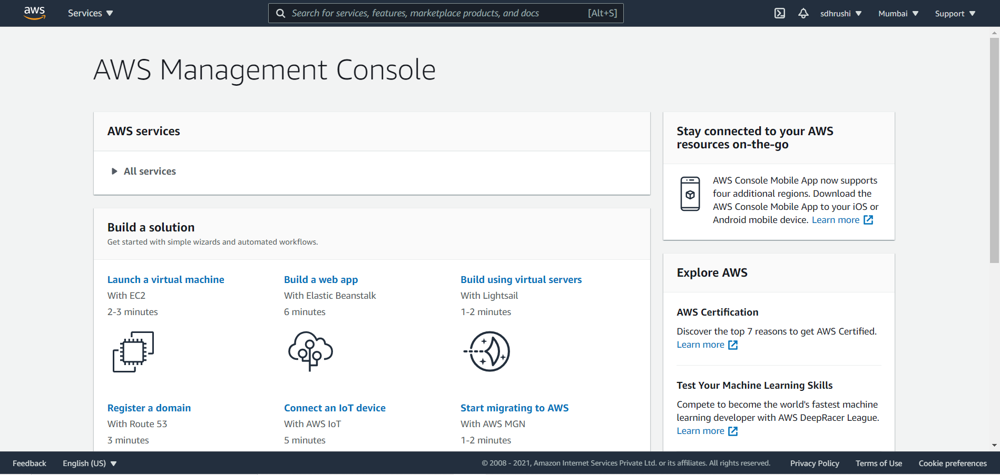

# Part 1

1. AIOps stands for Artificial Intelligence for IT operations. It is the application of artificial intelligence to enhance IT operations. By replacing multiple separate, manual IT operations tools with a single, intelligent, and automated IT operations platform, AIOps enables IT operations teams to respond more quickly to slowdowns and outages, with a lot less effort. AIOps uses big data, advanced analytics, and machine learning capabilities in order to:

    1. Collect and aggregate huge volumes of operations data generated by multiple IT infrastructure components, applications, and performance-monitoring tools.
    2. Filter ‘signals’ out of the ‘noise’ intelligently to identify significant events and patterns related to system performance and availability issues.
    3. Diagnose root causes and report them to IT for rapid response and remediation or, in some cases, automatically resolve these issues without human intervention.

While MLOps' goal is bridging the gap between data scientists and operation teams, and hence between ML model building and their execution, AIOps focuses on automating incidents management and intelligent root cause analysis. AIOps automates machines while MLOps standardizes ML system development processes.

Some of the salient features of MLOps and AIOps are listed below.

**MLOps**: 
* Multi-source data consumption
* Source Code Control
* Deployment and Test Services-Tracking ML model using metadata
* Automate ML experiments
* Mitigate risks and bias in model validation

**AIOps**:
* Application Monitoring-Automating manual or repetitive processes
* Anomaly Detection
* Predictive maintenance
* Incident management

Source: https://www.ibm.com/in-en/cloud/learn/aiops

2. The linear regression model forces the prediction to be a linear combination of features. Linearity leads to interpretable models. Linear effects are easy to quantify and describe. They are additive, so it is easy to separate the effects. If you suspect feature interactions or a nonlinear association of a feature with the target value, you can add interaction terms or use regression splines.

The linear relationship between features and the continuous target variable and the model’s monotonicity make the linear regression model interpretable . Given that all the assumptions for linear regression are met, and if the features are normalized, are not highly correlated to each other, and exhibit homoscedasticity (constant variance for the entire feature range), we can take a look at the model weights to tell how important the corresponding features are. If the target outcome with respect to the features follows a normal distribution, we can also attach confidence intervals.

The interpretation of a weight in the linear regression model depends on the type of the corresponding feature:
* Numerical feature: Increasing the numerical feature by one unit changes the estimated outcome by its weight.
* Binary feature: A feature that takes one of two possible values for each instance.  Changing the feature from the reference category to the other category changes the estimated outcome by the feature's weight.
* Categorical feature with multiple categories: A feature with a fixed number of possible values.
* Intercept $ \beta_{0} $: The intercept is the feature weight for the "constant feature", which is always 1 for all instances. Most software packages automatically add this "1"-feature to estimate the intercept. The interpretation is: For an instance with all numerical feature values at zero and the categorical feature values at the reference categories, the model prediction is the intercept weight. The interpretation of the intercept is usually not relevant because instances with all features values at zero often make no sense. The interpretation is only meaningful when the features have been standardised (mean of zero, standard deviation of one). Then the intercept reflects the predicted outcome of an instance where all features are at their mean value. 

Source: https://christophm.github.io/interpretable-ml-book/limo.html

3. Automated Machine Learning (AutoML) provides methods and processes to make Machine Learning available for non-Machine Learning experts, to improve efficiency of Machine Learning and to accelerate research on Machine Learning. 

Machine learning (ML) has achieved considerable successes in recent years and an ever-growing number of disciplines rely on it. However, this success crucially relies on human machine learning experts to perform the following tasks:

* Preprocess and clean the data.
* Select and construct appropriate features.
* Select an appropriate model family.
* Optimize model hyperparameters.
* Design the topology of neural networks (if deep learning is used).
* Postprocess machine learning models.
* Critically analyze the results obtained.

As the complexity of these tasks is often beyond non-ML-experts, the rapid growth of machine learning applications has created a demand for off-the-shelf machine learning methods that can be used easily and without expert knowledge. We call the resulting research area that targets progressive automation of machine learning AutoML.

AutoML makes it very easy for experts to build and implement real-world Machine Learning models whereas MLOps is communication among Data Scientists and the Production Team or Operations. It is deeply collaborative in nature, designed to eliminate waste, automate and generate Machine Learning with smarter, more consistent insights.

Open Source Tools:
* auto-sklearn, an open-source AutoML tool implemented in Python, built around scikit-learn library
* Amazon's AutoGluon open-source AutoML toolkit for Deep Learning, also available as AWS CloudFormation template
* TransmogrifAI, end-to-end AutoML toolkit for structured data written in Scala, that runs on Apache Spark
* Neural Network Intelligence, Microsoft's open-source AutoML toolkit
    
Commercial Tools:    
* AutoML Microsoft Azure cloud service
* Google Cloud AutoML solution on Google Cloud Platform
* AutoAI in IBM Watson Studio for automation of data preparation, model development, feature engineering, and hyper-parameter optimization
* Oracle Accelerated Data Science (ADS) SDK, a Python library included as part of the Oracle Cloud Infrastructure Data Science service

Source: https://en.wikipedia.org/wiki/Automated_machine_learning

# Part 2

**AWS Console Screenshot**

